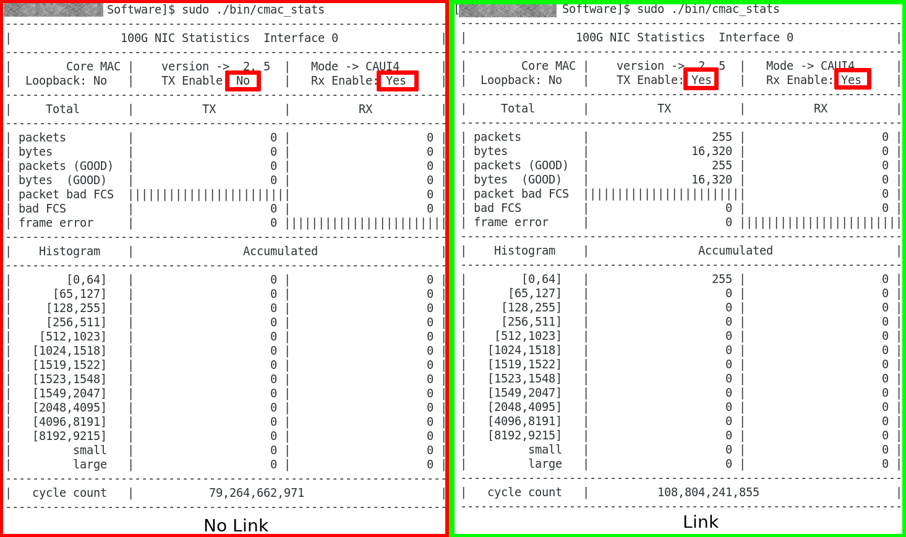
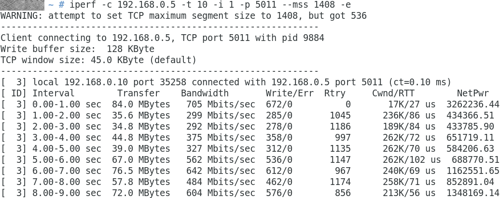
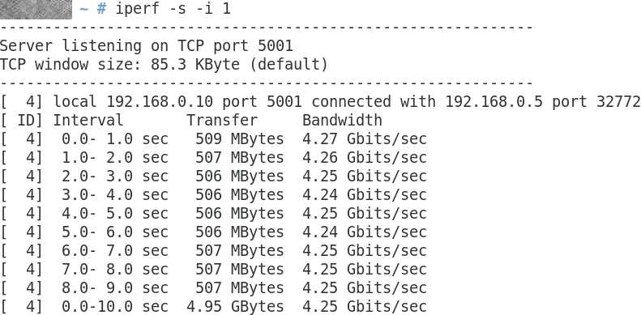

# Limago 100GbE Ethernet framework with TCP/IP support

## Introduction

This repository puts together all the necessary pieces to generate Limago.

Make sure you are using `Vivado 2018.3 IP Build 2404404`. It seems to be a bug in Vivado 2018.3.1 IP Build 2486929 that produces combinational loops in the synthesized HLS. 

*Before generating any project check each submodule's README.md to verify that everything is set properly*

## Supported Boards

So far [VCU118](https://www.xilinx.com/products/boards-and-kits/vcu118.html#hardware) and [Alveo U200](https://www.xilinx.com/products/boards-and-kits/alveo/u200.html#specifications) are supported. 

- Please check [README.md](submodules/cmac/README.md) of the CMAC wrapper to verify clock frequency for VCU118.
- The clock Frequency of the Alveo U200 can be configured using two pins, and the project already supports it.

In order to support Alveo U280 you must change the part for the HLS designs, run 

```
cd submodules/fpga-network-stack-core/scripts; sed -i 's/xcvu9p-flga2104-2l-e/xcu280-fsvh2892-2L-e/g' $(ls); cd -
```

## Cloning the repository

In order to clone this repository you need `git lfs` installed. 

This repository uses submodules and `git lfs`, check [Installing Git Large File Storage](https://help.github.com/en/articles/installing-git-large-file-storage) to install it.

```
git clone git@github.com:hpcn-uam/Limago.git --recursive
```

## How to build the projects

<details>
<summary>Click to show</summary>

The process is fully automated.

1.The first part consist on generating the necessary IP-Cores
```
make ips
```

2. Generate Vivado Project.

a. Check available projects
```
make help
```

b. Create Project
```
make create_prj_vcu118-fns-single-toe-iperf
```

Once the project is create you can open it. The projects are created under the folder `projects/<project_name>`

For instance, you can open the project with Vivado:

```
vivado projects/vcu118-fns-single-toe-iperf/vcu118-fns-single-toe-iperf.xpr
```

3. Implement a project 

You can either launch it manually from the GUI or using the following command:

```
make implement_prj_vcu118-fns-single-toe-iperf
```

*It is suggested to close the GUI when launching this command.*

</details>

## How to test if the design works

<details>
<summary>Click to show</summary>

### Check Physical Link

Once the FPGA has been programmed you can check if the link is up using the VIO (vio\_cmac\_synq\_0) within `Interfaces` hierarchy , the signal `cmac_sync_0_cmac_aligned_sync` must value '1'. 


 
If the board is attached through PCIe, the link can be checked using the `cmac_stats` program within the [Software](Software/) folder. In order to perform this, after programming the FPGA a host reboot is mandatory so as to enumerate the PCIe devices to detect the XDMA (PCIe rescan has not been tested). Check [README.md](Software/README.md) to download and install the driver. Execute `cmac_stats` and you will get the stats of the CMAC and the Tx and Rx status.



### Check Network Link

By default Limago IP address is 192.168.0.5, network mask 255.255.255.0 and its MAC address is 00:0a:35:02:9d:e5

Once you have configured your HOST with a proper IP address in the same subnetwork as Limago you can use `arping` and `ping` to reach Limago.

```
arping -I <interface_name> 192.168.0.5
ping 192.168.0.5
```


### Check application

#### Echo application

This section describes how to test the echo application, valid for the project(s): `vcu118-fns-single-toe-echo` 

In this case the Limago only echoes the payload of the connection to the port 15000, therefore you can use `telnet` or `ncat` to test it.


#### Iperf2 application

This section describes how to test the `iperf` (version 2) application, valid for the project(s): `vcu118-fns-single-toe-iperf` and `alveou200-fns-single-toe-iperf`

In this case, the FPGA can work both as a client and as a server. Make sure that you have installed `iperf` (version 2) in the server machine.

- FPGA as a server, which means the FPGA just gets data. By default the FPGA is listening to the range of ports between 5000 to 5063, therefore you can target any of those ports. Run the following code in the server with the NIC connected to Limago.

```
iperf -c 192.168.0.5 -t 10 -i 1 -p 5011 --mss 1408 -e
```



- FPGA as a client, which means Limago opens the TCP connection and sends the data. Therefore, the HOST machine needs to communicate with Limago using the XDMA driver. Run the following code in the HOST machine attached to the FPGA: 

First of all, the server machine must run `iperf` (version 2) a as server `iperf -s -i 1`. After that, you you can run the iperf application from the FPGA as a client.

```
sudo ./bin/hw_iperf2 -c <server_ip_address> -t 10 -p 5001 -e
```



</details>

## Citation
If you use [Limago](https://ieeexplore.ieee.org/document/8891991), the [TCP/IP stack](https://github.com/hpcn-uam/100G-fpga-network-stack-core) or the [checksum computation](https://github.com/hpcn-uam/efficient_checksum-offload-engine) in your project please cite one of the following papers accordingly and/or link to the GitHub repository:

```
@inproceedings{sutter2018fpga,
    title={{FPGA-based TCP/IP Checksum Offloading Engine for 100 Gbps Networks}},
    author={Sutter, Gustavo and Ruiz, Mario and L{\'o}pez-Buedo, Sergio and Alonso, Gustavo},
    booktitle={2018 International Conference on ReConFigurable Computing and FPGAs (ReConFig)},
    year={2018},
    organization={IEEE},
    doi={10.1109/RECONFIG.2018.8641729},
    ISSN={2640-0472},
    month={Dec},
}
@INPROCEEDINGS{ruiz2019tcp, 
    title={{Limago: an FPGA-based Open-source 100~GbE TCP/IP Stack}}, 
    author={Ruiz, Mario and Sidler, David and Sutter, Gustavo and Alonso, Gustavo and L{\'o}pez-Buedo, Sergio},
    booktitle={{2019 29th International Conference on Field Programmable Logic and Applications (FPL)}}, 
    year={2019},
    month={Sep},
    pages={286-292}, 
    organization={IEEE},
    doi={10.1109/FPL.2019.00053},
    ISSN={1946-147X}, 
}
```

# Acknowledgments

This is a collaborative project between: 
- HPCN group of the  Universidad Autónoma de Madrid. [web](http://www.hpcn-uam.es/)
- The spin-off Naudit HPCN. [web](http://www.naudit.es/en/)
- Systems Group of ETH Zürich University. [web](https://www.systems.ethz.ch/)

So far these people have contributed to Limago
- José Fernando Zazo josefernando.zazo@naudit.es
- Mario Ruiz mario.ruiz@uam.es
- David Sidler david.sidler@inf.ethz.ch
- Gustavo Sutter gustavo.sutter@uam.es
- Gustavo Alonso alonso@inf.ethz.ch
- Sergio López-Buedo sergio.lopez-buedo@uam.es

## License

This project is a collaboration between the Systems Group of ETH Zürich, Switzerland and HPCN Group of UAM, Spain. Furthermore, the starting point of this implementation is the [Scalable 10Gbps TCP/IP Stack Architecture for Reconfigurable Hardware](https://ieeexplore.ieee.org/abstract/document/7160037) by Sidler, D et al. The original implementation can be found in their [github](https://github.com/fpgasystems/fpga-network-stack).

For this project we keep the BSD 3-Clause License

```
BSD 3-Clause License

Copyright (c) 2019, 
HPCN Group, UAM Spain (hpcn-uam.es)
Systems Group, ETH Zurich (systems.ethz.ch)
All rights reserved.


Redistribution and use in source and binary forms, with or without
modification, are permitted provided that the following conditions are met:

* Redistributions of source code must retain the above copyright notice, this
  list of conditions and the following disclaimer.

* Redistributions in binary form must reproduce the above copyright notice,
  this list of conditions and the following disclaimer in the documentation
  and/or other materials provided with the distribution.

* Neither the name of the copyright holder nor the names of its
  contributors may be used to endorse or promote products derived from
  this software without specific prior written permission.

THIS SOFTWARE IS PROVIDED BY THE COPYRIGHT HOLDERS AND CONTRIBUTORS "AS IS"
AND ANY EXPRESS OR IMPLIED WARRANTIES, INCLUDING, BUT NOT LIMITED TO, THE
IMPLIED WARRANTIES OF MERCHANTABILITY AND FITNESS FOR A PARTICULAR PURPOSE ARE
DISCLAIMED. IN NO EVENT SHALL THE COPYRIGHT HOLDER OR CONTRIBUTORS BE LIABLE
FOR ANY DIRECT, INDIRECT, INCIDENTAL, SPECIAL, EXEMPLARY, OR CONSEQUENTIAL
DAMAGES (INCLUDING, BUT NOT LIMITED TO, PROCUREMENT OF SUBSTITUTE GOODS OR
SERVICES; LOSS OF USE, DATA, OR PROFITS; OR BUSINESS INTERRUPTION) HOWEVER
CAUSED AND ON ANY THEORY OF LIABILITY, WHETHER IN CONTRACT, STRICT LIABILITY,
OR TORT (INCLUDING NEGLIGENCE OR OTHERWISE) ARISING IN ANY WAY OUT OF THE USE
OF THIS SOFTWARE, EVEN IF ADVISED OF THE POSSIBILITY OF SUCH DAMAGE.
```