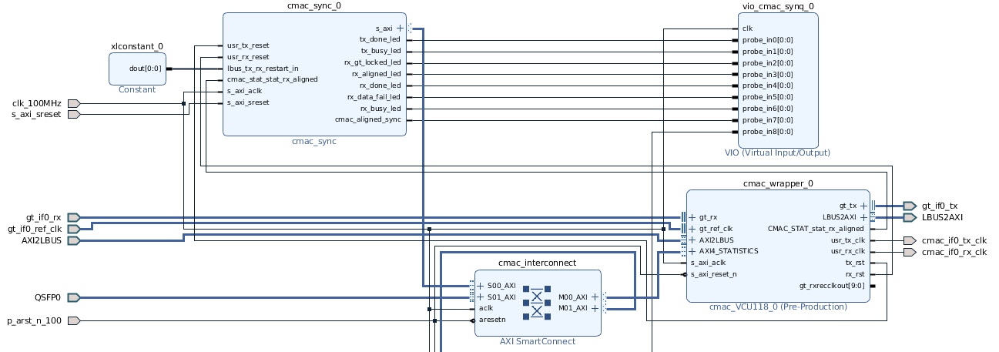

# 100GbE Ethernet for VCU118 development board


## Prerequisites

- Vivado 2018.2 or 2018.3
- License for CMAC Ultrascale + [See instructions below](#getting-xilinx-cmac-license)

*Without license you cannot synthesize and implement this IP-Core*

## Introduction

This repository wraps the 100GbE CMAC core from Xilinx. There are two pieces:
1. The actual CMAC core wrapper, which includes the LBUS to AXI4-Stream adapter.

*From Vivado 2019.1 the CMAC includes AXI4-Stream as an option. But we have not tested such functionality yet.*

2. The cmac_sync that run the bring up sequence. Refer to [Core Bring Up Sequence](https://www.xilinx.com/support/documentation/ip_documentation/cmac_usplus/v2_5/pg203-cmac-usplus.pdf)


*Before generating the IPs make sure that [`CONFIG.GT_REF_CLK_FREQ`](/scripts/xilinx_ips/cmac_uplus.tcl) match the frequency of the Si5328. By default the frequency is 156.25 MHz, but here we are using 161.1328125 MHz. For more details refer to [Clock Generation](https://www.xilinx.com/support/documentation/boards_and_kits/vcu118/ug1224-vcu118-eval-bd.pdf)*

## How to build the IPs

The process is fully automated, doing `make` is enough.

The Makefile is create in such a way that avoids regenerating the IPs if the source code does not change.

## Location

The IP-Cores include the constraint files that defines the location of each pin as well as timing-related constraints.

## Connections



xlconstant_0 is set to 0. Bare in mind that even though cmac_sync and cmac_wrapper_0 work in different clock domain, the cmac_sync logic synchronize the input signals and the constraints declare the asynchronous path. So, there is not need to declare any other constraint.

## Getting Xilinx CMAC License

Click `Get License` on [UltraScale+ Integrated 100G Ethernet Subsystem](https://www.xilinx.com/products/intellectual-property/cmac_usplus.html) and follow the steps.

# License

```
BSD 3-Clause License

Copyright (c) 2019, 
Naudit HPCN, Spain (naudit.es)
HPCN Group, UAM Spain (hpcn-uam.es)
All rights reserved.


Redistribution and use in source and binary forms, with or without
modification, are permitted provided that the following conditions are met:

* Redistributions of source code must retain the above copyright notice, this
  list of conditions and the following disclaimer.

* Redistributions in binary form must reproduce the above copyright notice,
  this list of conditions and the following disclaimer in the documentation
  and/or other materials provided with the distribution.

* Neither the name of the copyright holder nor the names of its
  contributors may be used to endorse or promote products derived from
  this software without specific prior written permission.

THIS SOFTWARE IS PROVIDED BY THE COPYRIGHT HOLDERS AND CONTRIBUTORS "AS IS"
AND ANY EXPRESS OR IMPLIED WARRANTIES, INCLUDING, BUT NOT LIMITED TO, THE
IMPLIED WARRANTIES OF MERCHANTABILITY AND FITNESS FOR A PARTICULAR PURPOSE ARE
DISCLAIMED. IN NO EVENT SHALL THE COPYRIGHT HOLDER OR CONTRIBUTORS BE LIABLE
FOR ANY DIRECT, INDIRECT, INCIDENTAL, SPECIAL, EXEMPLARY, OR CONSEQUENTIAL
DAMAGES (INCLUDING, BUT NOT LIMITED TO, PROCUREMENT OF SUBSTITUTE GOODS OR
SERVICES; LOSS OF USE, DATA, OR PROFITS; OR BUSINESS INTERRUPTION) HOWEVER
CAUSED AND ON ANY THEORY OF LIABILITY, WHETHER IN CONTRACT, STRICT LIABILITY,
OR TORT (INCLUDING NEGLIGENCE OR OTHERWISE) ARISING IN ANY WAY OUT OF THE USE
OF THIS SOFTWARE, EVEN IF ADVISED OF THE POSSIBILITY OF SUCH DAMAGE.
```

